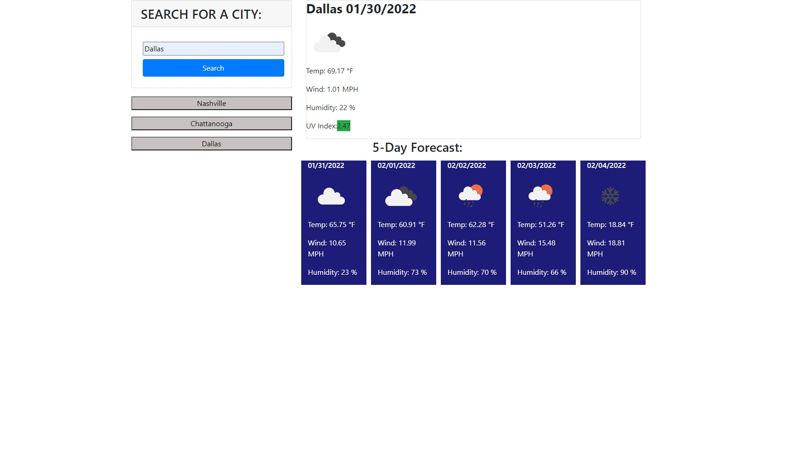

# Weather-forecast

## Purpose
This webpage displays the current weather and 5 day forecast for any user input city. 
The current forecast shows the city name, the date, the temperature, wind, humidity, and UV index.
The 5 day forecast shows the date, temperature, wind, and humidity for each day.
Recent searches also appear beneath the input, and can be clicked on to see that city's forecast again.

## Outline
* the city search input and recent cities list are shown by default. 
* Once a city name is put in and the search button is clicked, the current and 5 day forecast will be dynamically created and displayed.

## Built With
* HTML
* CSS 
* Javascript 
* Onecall Api

## Screenshot

## Website 
https://j-maclellan.github.io/weather-forecast/

## Contributor
* j-maclellan